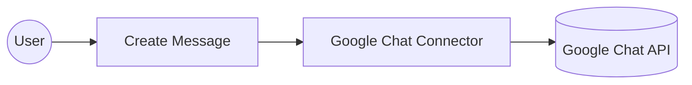
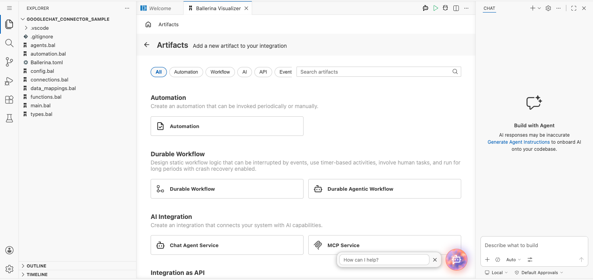
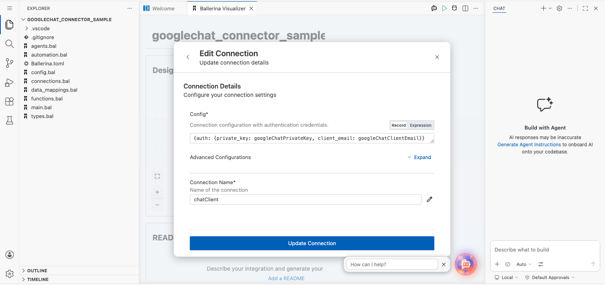
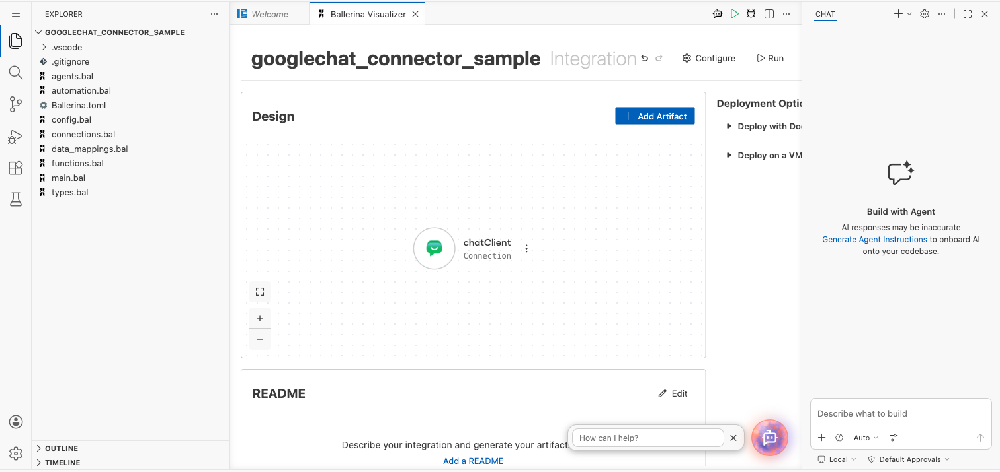
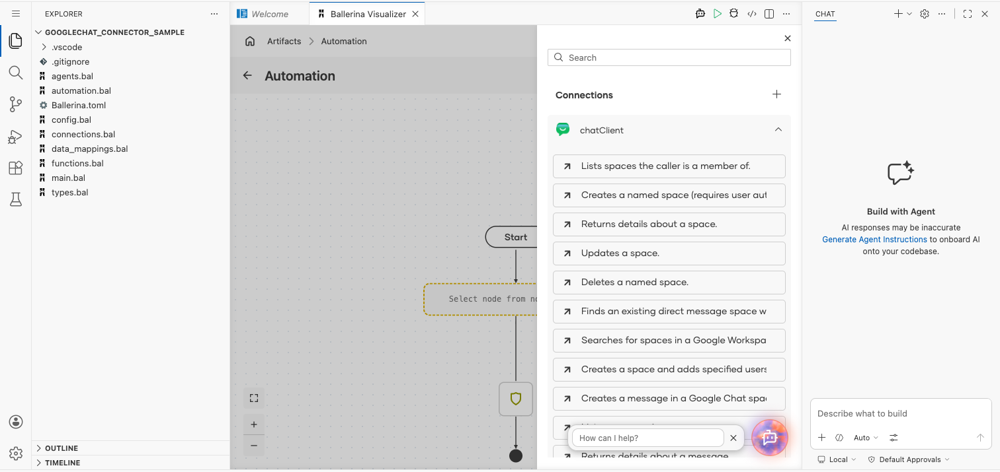
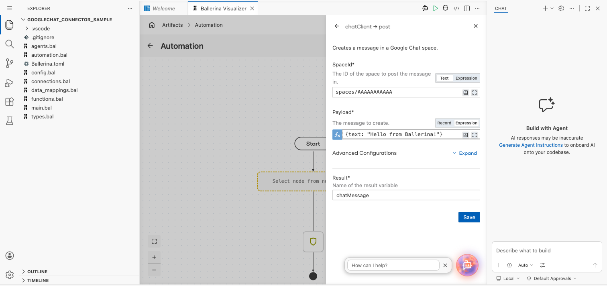
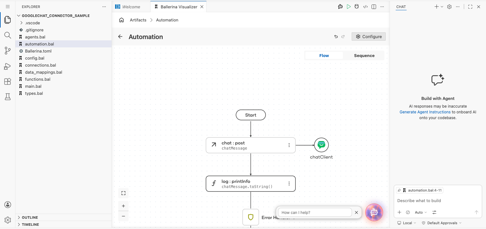

# Example

## What you'll build

This example builds an automation that posts a text message to a Google Chat space through the Google Chat connector. The automation calls the **Creates a message in a Google Chat space** operation with a space ID and a text payload, then logs the message returned by the Google Chat API.

**Operations used:**
- **Creates a message in a Google Chat space** : Creates a message in a Google Chat space.

## Architecture

## Prerequisites

- A Google Cloud service account with the Google Chat API enabled, and its private key and client email.

## Setting up the Google Chat integration

> **New to WSO2 Integrator?** Follow the [Create a New Integration](../../../../develop/create-integrations/create-new-integration.md) guide to set up your integration first, then return here to add the connector.

## Adding the Google Chat connector

### Step 1: Open the connector palette

Select **Add Connection** in the **Connections** section.

### Step 2: Select the Google Chat connector

1. Enter `chat` in the search field.
2. Select the **Chat** connector card under `ballerinax / googleapis.chat`.

## Configuring the Google Chat connection

### Step 3: Bind the connection parameters to configurable variables

Bind the required connection field to configurable variables.

- **Config** : The connection configuration, including the service account credentials, bound to configurables holding the private key and client email.

### Step 4: Save the connection

Select **Save** and verify that the connection appears in the **Connections** section.

### Step 5: Set actual values for your configurables

1. Select **Configurations** at the bottom of the project tree under **Data Mappers**.
2. Enter a value for each configurable listed below before you run the integration.

- **googleChatPrivateKey** (`configurable string`) : The private key from the Google Cloud service account credentials.
- **googleChatClientEmail** (`configurable string`) : The client email from the Google Cloud service account credentials.

## Configuring the Google Chat Create Message operation

### Step 6: Add an automation entry point

1. Select **Add Entry Point** next to **Entry Points**.
2. Select **Automation**.
3. Select **Create** to accept the settings.

### Step 7: Expand the connection and configure the Create Message operation

1. Select **Add Step** in the automation flow.
2. Expand **chatClient** to display its operations.

3. Select **Creates a message in a Google Chat space** and enter its required values.

- **Space Id** : The ID of the space to post the message in.
- **Payload** : The message to create, as a record with the message text in `text`.

4. Select **Save**.

### Step 8: Log the Create Message result

Add a log action for the returned value, then return to the visual flow.

## Try it yourself

Try this sample in WSO2 Integration Platform.

[View source on GitHub](https://github.com/wso2/integration-samples/tree/main/integrator-default-profile/connectors/ballerinax_googleapis_chat_connector_sample)

## More code examples

The `googleapis.chat` connector provides practical examples illustrating usage in various scenarios. Explore these [examples](https://github.com/ballerina-platform/module-ballerinax-googleapis.chat/tree/main/examples).

1. [Echo bot](https://github.com/ballerina-platform/module-ballerinax-googleapis.chat/tree/main/examples/echo-bot) — A minimal Google Chat app that replies to every message with the same text, demonstrating the listener's HTTP delivery mode and replying via the injected `chat:MessageCaller`.
