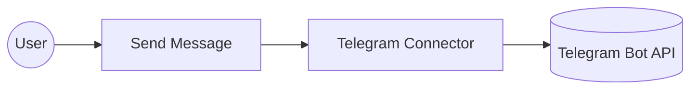
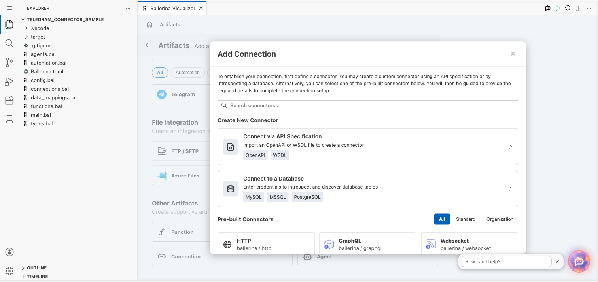
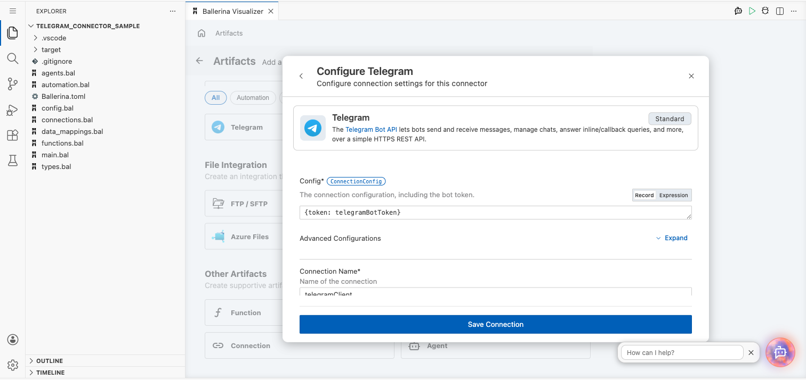
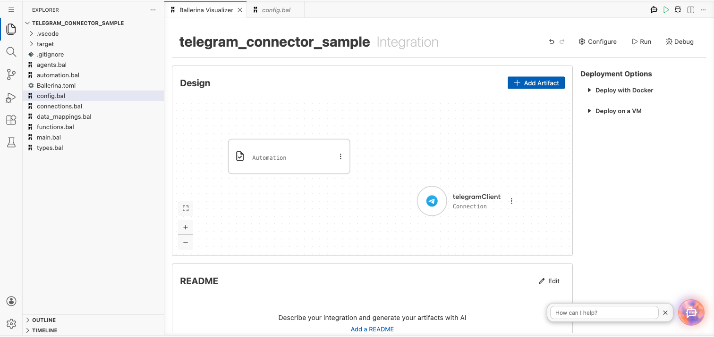
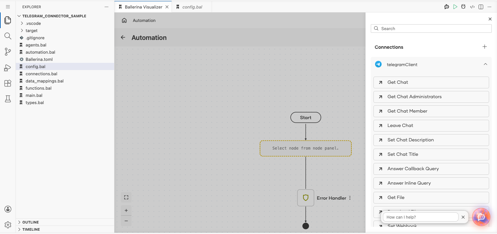
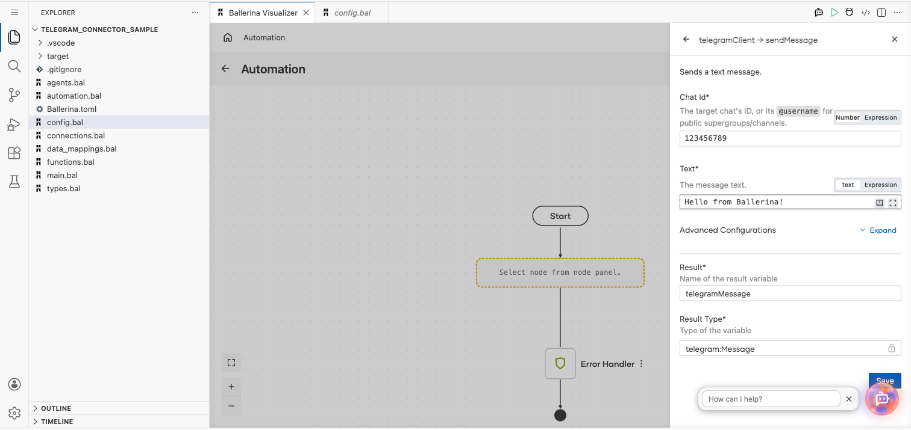
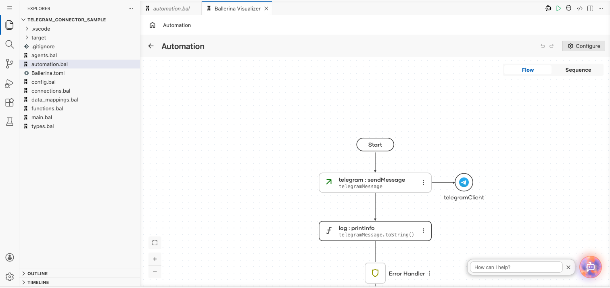

# Example

## What you'll build

This example builds an automation that sends a text message through the Telegram connector. The automation calls the **Send Message** operation with a chat ID and a text payload, then logs the message returned by the Telegram Bot API.

**Operations used:**
- **Send Message** : Sends a text message.

## Architecture

## Prerequisites

- A Telegram bot token, created through [BotFather](https://core.telegram.org/bots#botfather), and the chat ID of the recipient.

## Setting up the Telegram integration

> **New to WSO2 Integrator?** Follow the [Create a New Integration](../../../../develop/create-integrations/create-new-integration.md) guide to set up your integration first, then return here to add the connector.

## Adding the Telegram connector

### Step 1: Open the connector palette

Select **Add Connection** in the **Connections** section.

### Step 2: Select the Telegram connector

1. Enter `telegram` in the search field.
2. Select the **Telegram** connector card.

## Configuring the Telegram connection

### Step 3: Bind the connection parameters to configurable variables

Bind the required connection field to a configurable variable.

- **Config** : The connection configuration, including the bot token, bound to a configurable holding the Telegram bot token.

### Step 4: Save the connection

Select **Save** and verify that the connection appears in the **Connections** section.

### Step 5: Set actual values for your configurables

1. Select **Configurations** at the bottom of the project tree under **Data Mappers**.
2. Enter a value for each configurable listed below before you run the integration.

- **telegramBotToken** (`configurable string`) : The bot token for the Telegram Bot API.

## Configuring the Telegram Send Message operation

### Step 6: Add an automation entry point

1. Select **Add Entry Point** next to **Entry Points**.
2. Select **Automation**.
3. Select **Create** to accept the settings.

### Step 7: Expand the connection and configure the Send Message operation

1. Select **Add Step** in the automation flow.
2. Expand **telegramClient** to display its operations.

3. Select **Send Message** and enter its required values.

- **Chat Id** : The target chat's ID, or its `@username` for public supergroups/channels.
- **Text** : The message text to send.

4. Select **Save**.

### Step 8: Log the Send Message result

Add a log action for the returned value, then return to the visual flow.

## Try it yourself

Try this sample in WSO2 Integration Platform.

[View source on GitHub](https://github.com/wso2/integration-samples/tree/main/integrator-default-profile/connectors/ballerinax_telegram_connector_sample)

## More code examples

The `telegram` connector provides practical examples illustrating usage in various scenarios. Explore these [examples](https://github.com/ballerina-platform/module-ballerinax-telegram/tree/main/examples).

1. [Send a Telegram message](https://github.com/ballerina-platform/module-ballerinax-telegram/tree/main/examples/send-message) — send a text message, a photo by URL, and an uploaded document via the client.
2. [Run a Telegram approval bot](https://github.com/ballerina-platform/module-ballerinax-telegram/tree/main/examples/approval-bot) — handle all nine update types over the listener, including an approve/decline flow.
