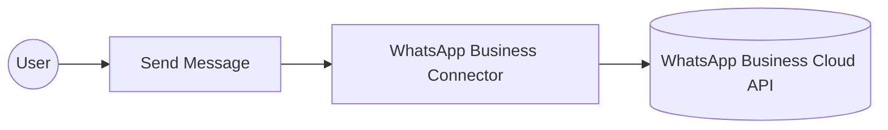
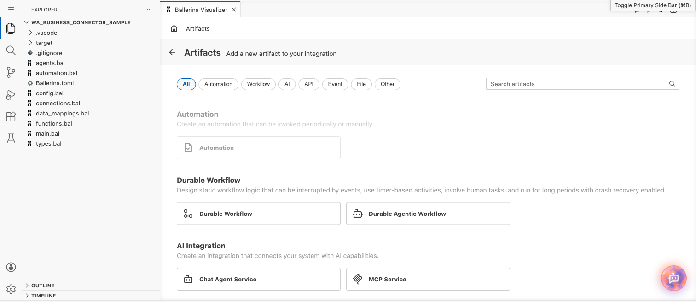
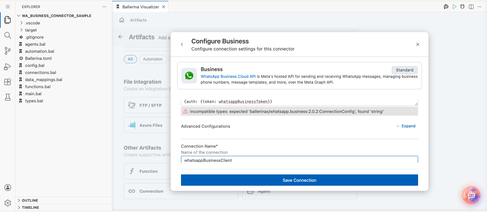
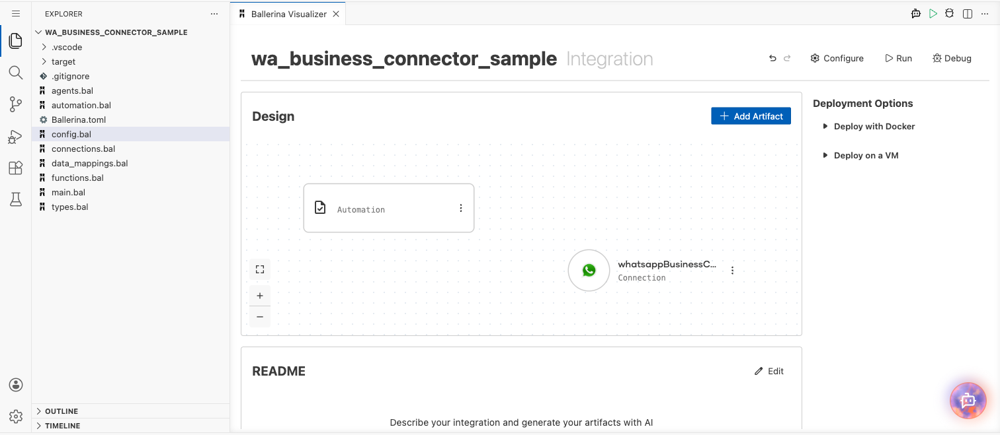
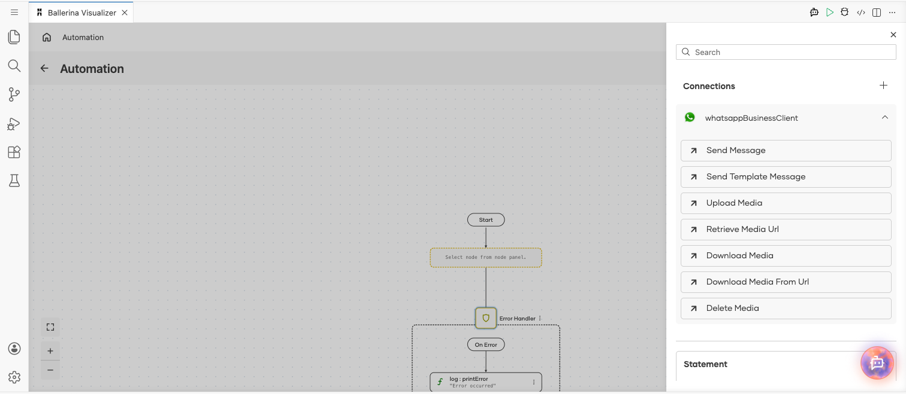
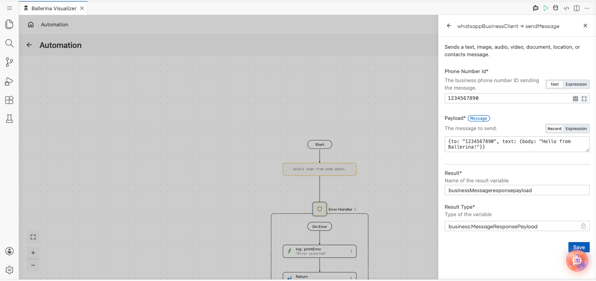
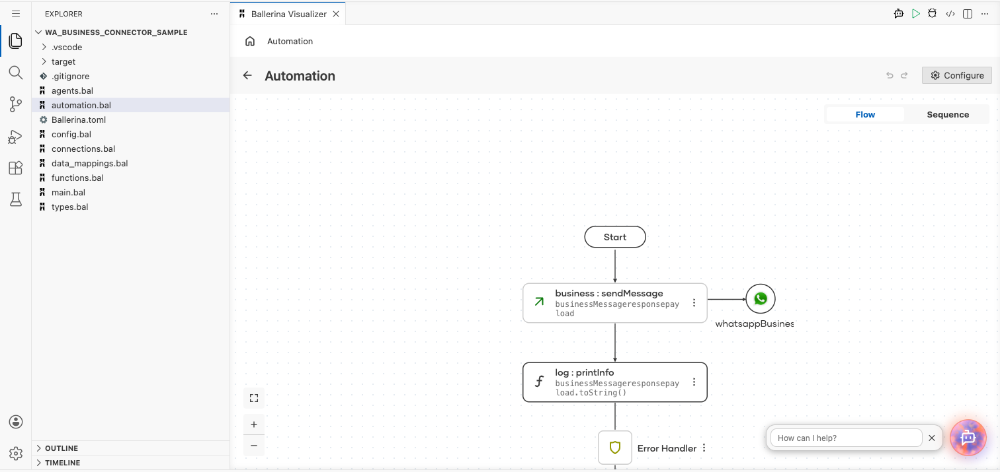

# Example

## What you'll build

This example builds an automation that sends a WhatsApp text message through the WhatsApp Business connector. The automation calls the **Send Message** operation with a recipient phone number and a text payload, then logs the response returned by the WhatsApp Business Cloud API.

**Operations used:**
- **Send Message** : Sends a text, image, audio, video, document, location, or contacts message.

## Architecture

## Prerequisites

- A Meta developer account with a WhatsApp Business app, a business phone number ID, and a bearer token for the WhatsApp Business Cloud API.

## Setting up the WhatsApp Business integration

> **New to WSO2 Integrator?** Follow the [Create a New Integration](../../../../develop/create-integrations/create-new-integration.md) guide to set up your integration first, then return here to add the connector.

## Adding the WhatsApp Business connector

### Step 1: Open the connector palette

Select **Add Connection** in the **Connections** section.

### Step 2: Select the WhatsApp Business connector

1. Enter `whatsapp.business` in the search field.
2. Select the **Business** connector card.

## Configuring the WhatsApp Business connection

### Step 3: Bind the connection parameters to configurable variables

Bind the required connection field to a configurable variable.

- **Config** : The connection configuration, including the bearer-token auth, bound to a configurable holding the WhatsApp Business API token.

### Step 4: Save the connection

Select **Save** and verify that the connection appears in the **Connections** section.

### Step 5: Set actual values for your configurables

1. Select **Configurations** at the bottom of the project tree under **Data Mappers**.
2. Enter a value for each configurable listed below before you run the integration.

- **whatsappBusinessToken** (`configurable string`) : The bearer token for the WhatsApp Business Cloud API.

## Configuring the WhatsApp Business Send Message operation

### Step 6: Add an automation entry point

1. Select **Add Entry Point** next to **Entry Points**.
2. Select **Automation**.
3. Select **Create** to accept the settings.

### Step 7: Expand the connection and configure the Send Message operation

1. Select **Add Step** in the automation flow.
2. Expand **whatsappBusinessClient** to display its operations.

3. Select **Send Message** and enter its required values.

- **Phone Number Id** : The business phone number ID sending the message.
- **Payload** : The message to send, as a record with the recipient's number in `to` and the message text in `text.body`.

4. Select **Save**.

### Step 8: Log the Send Message result

Add a log action for the returned value, then return to the visual flow.

## Try it yourself

Try this sample in WSO2 Integration Platform.

[View source on GitHub](https://github.com/wso2/integration-samples/tree/main/integrator-default-profile/connectors/ballerinax_whatsapp_business_connector_sample)

## More code examples

The `whatsapp.business` connector provides practical examples illustrating usage in various scenarios. Explore these [examples](https://github.com/ballerina-platform/module-ballerinax-whatsapp.business/tree/main/examples).

1. [Send a WhatsApp message](https://github.com/ballerina-platform/module-ballerinax-whatsapp.business/tree/main/examples/send-message) — send a text message and receive replies/status updates over a webhook listener.
